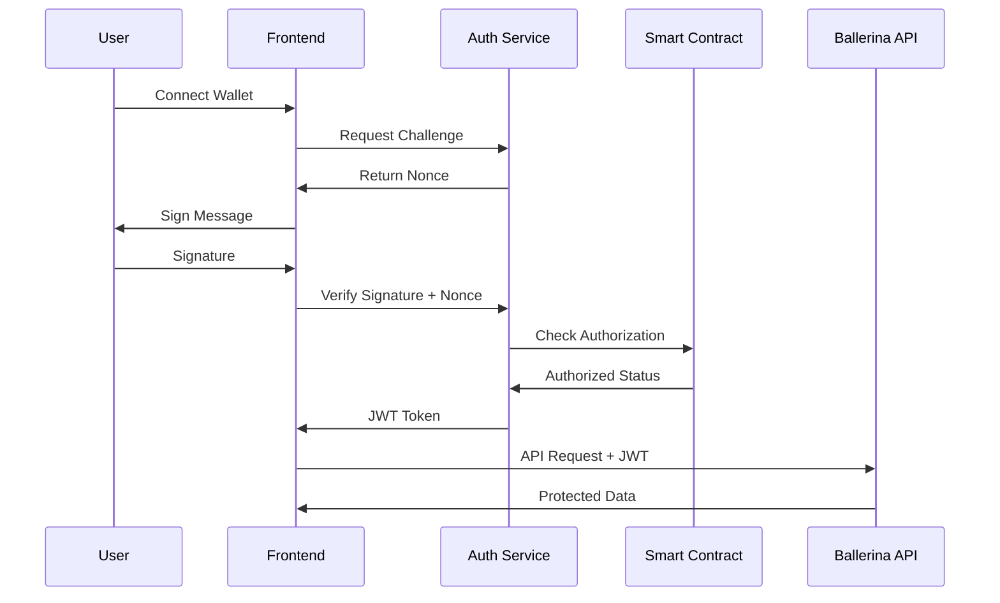

# Web3 + JWT Authentication Integration

This document describes the new Web3 + JWT authentication system integrated with your Transparent Governance Platform.

## 🌟 Features Added

- **Web3 Wallet Authentication**: Secure MetaMask signature-based login
- **Smart Contract Authorization**: Verify wallet permissions via blockchain
- **Enterprise JWT Management**: Asgardeo-compatible token system
- **Automatic Token Refresh**: Seamless session management
- **Security Hardened**: Rate limiting, input validation, CORS protection

## 📁 New Project Structure

```
Transparent-Governance-Platform-Ballerina/
├── auth-service/                 # ← NEW: Authentication microservice
│   ├── src/
│   │   ├── Web3AuthService.js   # Main auth logic
│   │   └── server.js            # Express server
│   ├── package.json
│   ├── .env.example
│   ├── start-auth-service.ps1   # Startup script
│   └── README.md
├── client/                      # ← UPDATED: Frontend with Web3 auth
│   ├── src/
│   │   ├── providers/
│   │   │   └── Web3AuthProvider.tsx  # ← NEW: Auth context
│   │   ├── components/
│   │   │   └── Web3LoginCard.tsx     # ← NEW: Login component
│   │   ├── hooks/
│   │   │   └── useAuthenticatedApi.ts # ← NEW: API hook
│   │   ├── lib/
│   │   │   └── auth-config.ts        # ← NEW: Auth configuration
│   │   └── app/
│   │       └── auth-demo/            # ← NEW: Demo page
│   │           └── page.tsx
│   └── .env.local.example       # ← NEW: Frontend env template
├── server/                      # Your existing Ballerina backend
└── smart-contracts/            # Your existing contracts
```

## 🚀 Quick Start

### 1. Start Authentication Service

```powershell
# Navigate to auth service
cd auth-service

# Install dependencies
npm install

# Configure environment
cp .env.example .env
# Edit .env with your Asgardeo and blockchain settings

# Start the service
./start-auth-service.ps1
# OR
npm run dev
```

The auth service will run on **http://localhost:3001**

### 2. Update Frontend Configuration

```bash
# Navigate to client
cd client

# Install new dependencies (already done)
npm install @asgardeo/auth-react

# Configure environment
cp .env.local.example .env.local
# Edit .env.local with your settings
```

### 3. Start Frontend

```powershell
cd client
./start-client.ps1
# OR
npm run dev
```

### 4. Start Your Ballerina Backend

```powershell
cd server
./start-server.ps1
# OR
bal run
```

## 🌐 Access Points

- **Frontend**: http://localhost:3000
- **Auth Demo**: http://localhost:3000/auth-demo
- **Auth Service**: http://localhost:3001
- **Ballerina API**: http://localhost:8080
- **Auth Health Check**: http://localhost:3001/health

## 🔧 Configuration Required

### 1. Asgardeo Setup (Already Configured)
- **Base URL**: `https://api.asgardeo.io/t/razzallworks`
- **Client ID**: `fltg4uoj2AgN8PibtkuNtfMDeXEa`
- **Client Secret**: `PaiCFb61dG8DBQPuX6G9ntmG3ppbalFIhB_npQIJZQsa`

### 2. Blockchain Configuration (Update Required)
```env
# Update these in auth-service/.env
BLOCKCHAIN_RPC_URL=https://mainnet.infura.io/v3/YOUR_INFURA_KEY
CONTRACT_ADDRESS=0x742d35CC6634C0532925a3b8D402B405F4032888
CONTRACT_ABI='[{"inputs":[{"internalType":"address","name":"user","type":"address"}],"name":"isAuthorized","outputs":[{"internalType":"bool","name":"","type":"bool"}],"stateMutability":"view","type":"function"}]'
```

### 3. Security Secrets (Generate New)
```env
# Generate secure random strings for production
JWT_SECRET=your-secure-jwt-secret-must-be-at-least-32-characters
TEMP_JWT_SECRET=your-temp-jwt-secret-must-be-at-least-32-characters
```

## 🔐 Authentication Flow



## 🎯 Integration Points

### 1. Frontend Integration
```typescript
// Use the Web3AuthProvider
import { useWeb3Auth } from '@/providers/Web3AuthProvider';

function MyComponent() {
  const { 
    isFullyAuthenticated, 
    connectWallet, 
    makeAuthenticatedRequest 
  } = useWeb3Auth();
  
  // Make authenticated requests to your Ballerina API
  const data = await makeAuthenticatedRequest('/api/petitions');
}
```

### 2. Ballerina Backend Integration
You can verify JWT tokens in your Ballerina services:

```ballerina
// Add JWT validation to your existing endpoints
http:Request request = // your request
string authHeader = request.getHeader("Authorization");
// Validate JWT token with auth service
```

### 3. Smart Contract Integration
Your contract should implement:

```solidity
mapping(address => bool) public authorizedUsers;

function isAuthorized(address user) external view returns (bool) {
    return authorizedUsers[user];
}
```

## 📊 Testing the System

### 1. Visit the Demo Page
Navigate to http://localhost:3000/auth-demo to test the complete flow.

### 2. Test API Endpoints
```bash
# Health check
curl http://localhost:3001/health

# Protected endpoint (requires JWT)
curl -H "Authorization: Bearer <your-jwt>" http://localhost:3001/api/protected
```

### 3. Integration with Existing Pages
Add the `Web3LoginCard` component to any existing page:

```tsx
import Web3LoginCard from '@/components/Web3LoginCard';

export default function MyPage() {
  return (
    <div>
      <Web3LoginCard />
      {/* Your existing content */}
    </div>
  );
}
```

## 🔄 Migration Strategy

### Phase 1: Parallel Operation
- Keep existing authentication system
- Add Web3 auth as optional
- Test with select users

### Phase 2: Integration
- Update existing pages to support both auth methods
- Migrate user data if needed
- Update API endpoints to accept JWT

### Phase 3: Full Migration
- Make Web3 auth primary
- Deprecate old system
- Update all components

## 🐛 Troubleshooting

### Common Issues

1. **MetaMask Not Connecting**
   - Ensure MetaMask is installed
   - Check browser console for errors
   - Verify network configuration

2. **Smart Contract Errors**
   - Check RPC URL connectivity
   - Verify contract address and ABI
   - Ensure contract has authorization method

3. **JWT Token Issues**
   - Verify JWT secrets are set
   - Check token expiration
   - Ensure consistent secrets across restarts

4. **CORS Errors**
   - Verify FRONTEND_URL in auth service
   - Check browser network tab for details

### Debug Mode
Set `NODE_ENV=development` in auth service for detailed logging.

## 🚀 Production Deployment

### Security Checklist
- [ ] Generate secure JWT secrets
- [ ] Configure proper CORS origins
- [ ] Set up HTTPS/SSL
- [ ] Enable rate limiting
- [ ] Set up monitoring and logging
- [ ] Use Redis for session storage
- [ ] Configure backup strategies

### Recommended Architecture
```
┌─────────────┐    ┌─────────────┐    ┌─────────────┐
│  Frontend   │────│   Gateway   │────│ Auth Service│
│  (Next.js)  │    │  (Nginx)    │    │ (Node.js)   │
└─────────────┘    └─────────────┘    └─────────────┘
                                              │
                                    ┌─────────────┐
                                    │  Ballerina  │
                                    │   Backend   │
                                    └─────────────┘
```

## 📝 Next Steps

1. **Test the Demo**: Visit `/auth-demo` and test the full flow
2. **Configure Blockchain**: Update your RPC URL and contract details
3. **Integrate with Existing Pages**: Add Web3 authentication to your current workflows
4. **Smart Contract Deployment**: Deploy or configure your authorization contract
5. **Production Setup**: Configure for your production environment

## 🆘 Support

If you encounter issues:
1. Check the console logs in both auth service and frontend
2. Verify all environment variables are set
3. Test individual endpoints with curl/Postman
4. Review the detailed README files in each service

The authentication system is now ready for testing and integration with your Transparent Governance Platform! 🎉
